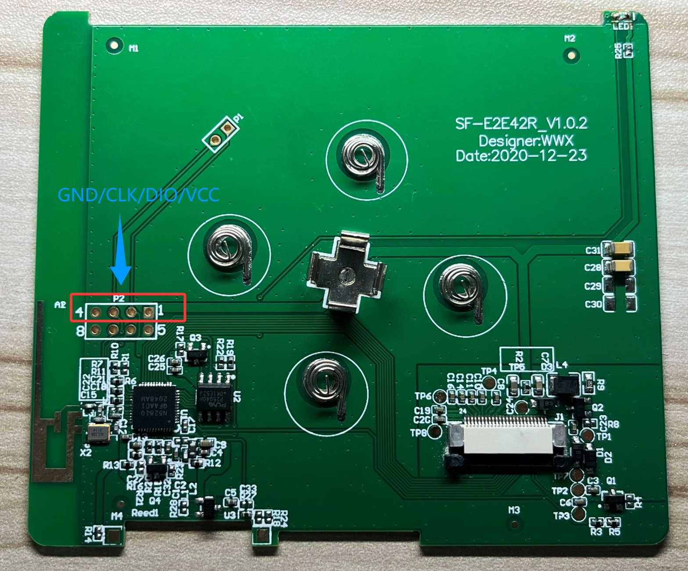
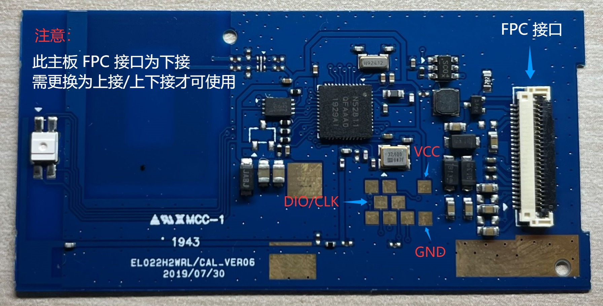

## 支持设备

只要是基于 `nrf51822` / `nrf51802` / `nrf52811` / `nrf52810` 的价签，理论上都支持。

下面列举几个适配了的价签驱动板。

### 老五 4.2 寸价签，黑白双色版本

- MCU：nrf51822
- RAM：16K
- ROM：128K
- 驱动：UC8176
- 屏幕引脚：0508090A0B0C0D
- 线圈引脚：07

### 老五 4.2 寸价签，黑白红三色版本

- MCU：nrf51802
- RAM：16K
- ROM：256K
- 驱动：UC8176
- 屏幕引脚：0A0B0C0D0E0F10
- 线圈引脚：09
- LED引脚：03/04/05 （有三个 LED，任选一个使用）

### 思飞 52810

- MCU：nrf52810
- RAM：24K
- ROM：192K

### 盒马/阿里 52811

- MCU：nrf52811
- RAM：24K
- ROM：192K

